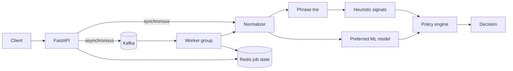

# Architecture

## Current architecture

Sentinel exposes both a synchronous decision path and an asynchronous job path. The moderation
engine is shared: FastAPI validates text, normalization reduces common obfuscations, and a trie
finds policy phrases. The service prefers a fine-tuned DistilBERT classifier, falls back to TF-IDF
logistic regression, and combines the selected model with heuristic signals.

See [Distributed moderation architecture](distributed-architecture.md) for delivery semantics,
idempotency, retries, the dead-letter queue, and local operation.

## Next architecture increments

Kafka now buffers submissions and worker replicas can join one consumer group. Future increments
add vector retrieval, campaign detection, PostgreSQL decision history, and a review queue that
produces controlled feedback for retraining.

Implemented reliability controls include idempotency keys, bounded retries, a dead-letter queue,
explicit offset commits, and graceful model fallback. Circuit breakers, distributed traces,
failure injection, and explicit error-budget dashboards remain planned.
