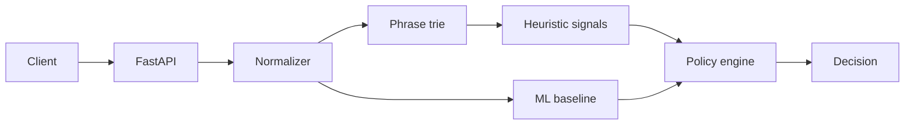

# Architecture

## Current milestone

The service remains synchronous for the first two milestones. FastAPI validates a text request,
the normalization layer reduces common obfuscations, a trie finds policy phrases, and an
optional TF-IDF logistic-regression baseline provides a toxicity probability. The policy engine
combines those independent signals into a versioned decision.

## Target architecture

The production-oriented version separates synchronous admission from asynchronous deep
analysis. Kafka buffers submissions; horizontally scalable workers run heuristic, transformer,
and vector-retrieval stages. PostgreSQL stores decisions and policy history, while a review
queue produces labels for retraining.

Reliability requirements include idempotency keys, bounded retries, a dead-letter queue,
circuit breakers, graceful model fallback, distributed traces, and explicit error budgets.
