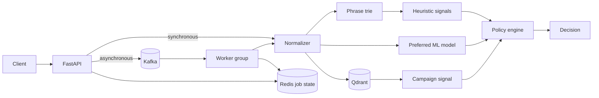

# Architecture

## Current architecture

Sentinel exposes both a synchronous decision path and an asynchronous job path. The moderation
engine is shared: FastAPI validates text, normalization reduces common obfuscations, and a trie
finds policy phrases. The service prefers a fine-tuned DistilBERT classifier, falls back to TF-IDF
logistic regression, and combines the selected model with heuristic and vector-campaign signals.

See [Distributed moderation architecture](distributed-architecture.md) for delivery semantics,
idempotency, retries, the dead-letter queue, and local operation. See
[Threat-intelligence architecture](threat-intelligence-architecture.md) for vector retrieval,
campaign thresholds, and the data-minimization boundary.

## Next architecture increments

Kafka buffers submissions and worker replicas can join one consumer group. Qdrant now retrieves
near-duplicate content vectors and raises coordinated-campaign signals. Future increments add
PostgreSQL decision history and a review queue that produces controlled feedback for retraining.

Implemented reliability controls include idempotency keys, bounded retries, a dead-letter queue,
explicit offset commits, and graceful model fallback. Circuit breakers, distributed traces,
failure injection, and explicit error-budget dashboards remain planned.
