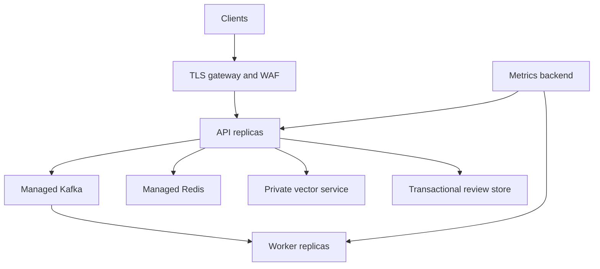

# Deployment guide

## Local demonstration

`docker compose up -d --build` starts the complete single-machine stack. Published ports bind to
`127.0.0.1`, the API and worker run without Linux capabilities on read-only root filesystems, and
only named data volumes remain writable. The public reviewer tokens and anonymous Grafana viewer
are local-development conveniences.

## Production reference topology



## Required changes before internet exposure

1. Put the API behind a TLS gateway or load balancer. Enforce the body limit and a shared
   identity-aware rate limit there; the bundled token bucket protects only one process.
2. Set the values in `config/production.env.example` through the deployment platform. Sentinel
   refuses production mode when docs, HSTS, or rate limiting are unsafe.
3. Replace reviewer demo credentials with an identity provider or secrets-manager-provisioned
   tokens. Mount secrets read-only; never build them into the image.
4. Use authenticated TLS connections to Kafka, Redis and Qdrant on private networks.
5. Replace the JSONL review ledger with a transactional append-only database or event store when
   running multiple API replicas.
6. Store model artifacts in a signed registry or controlled object store. Verify digest and model
   metadata before rollout.
7. Send logs and metrics to access-controlled backends with retention policies. Do not label
   metrics with request IDs, text, URLs, filenames, or reviewer notes.
8. Back up review state and data-service volumes; test restore and audit-chain verification.

## Release gates

```bash
python -m pytest
python -m ruff check .
python scripts/generate_sbom.py
python scripts/check_security_configuration.py
python scripts/check_evaluation_gate.py --model-version sentinel-max-ensemble-v1
docker compose config --quiet
```

The committed SBOM must remain byte-for-byte consistent with `uv.lock`. CI uploads it as release
evidence. CodeQL scans Python changes, Dependabot opens bounded weekly update pull requests, and a
scheduled Trivy workflow builds the CPU-only inference image and publishes HIGH/CRITICAL findings
to GitHub code scanning. Trivy is advisory because vulnerability feeds change independently of a
source commit; security owners must triage and set release policy for confirmed reachable issues.

## Rollback

Deploy immutable image digests and retain the previously approved image, policy configuration,
model version, and schema. A rollback must preserve the review ledger and queue state. After
rollback, verify readiness, Prometheus targets, queue consumption, DLQ rate, review backlog, and
the evaluation-gate artifact associated with the restored model.
