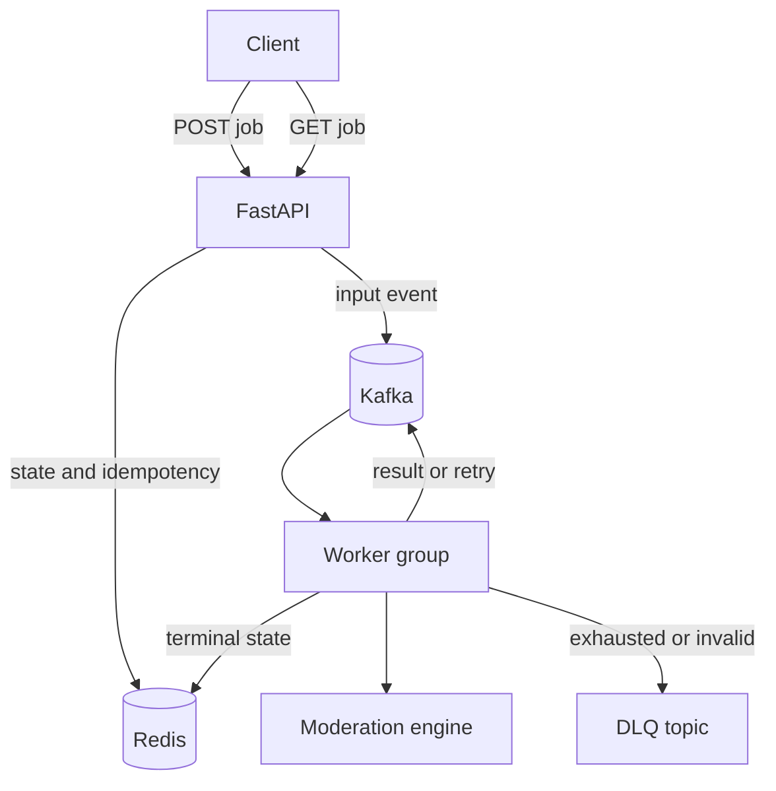

# Distributed moderation architecture

Milestone 4 adds an asynchronous path for workloads that do not require an immediate decision.
The original synchronous endpoint remains available for latency-sensitive requests.



## Components

| Component | Responsibility |
| --- | --- |
| FastAPI | Validates requests, assigns deterministic job IDs, and exposes job status. |
| Redis | Stores job state and enforces create-if-absent idempotency with `SET NX`. |
| Kafka | Buffers input, retry, result, and dead-letter events across three partitions. |
| Worker group | Runs the existing layered moderation engine and explicitly commits offsets. |
| DLQ | Retains sanitized failure metadata after schema failure or exhausted processing attempts. |

## Request lifecycle

1. `POST /v1/moderation/jobs` accepts a request and returns HTTP 202.
2. A UUID5 job ID is derived from `request_id`. Redis atomically creates the initial state.
3. Replaying the same ID and content returns the existing job without publishing another event.
   Reusing the ID with different content returns HTTP 409.
4. The API publishes an input event with `acks=all` and an idempotent Kafka producer.
5. A worker marks the job processing, evaluates the request, publishes a result, and stores the
   terminal state.
6. The worker commits its source offset only after all required publications and state writes
   succeed. A crash before the commit causes redelivery.

## Delivery and failure semantics

The pipeline is **at least once**, not exactly once. Kafka can redeliver an event after a worker
crash. Stable job IDs and terminal-state checks suppress repeated model execution after a job has
already succeeded. This is application-level deduplication, not a distributed transaction across
Kafka and Redis.

Processing failures are retried up to three total attempts. The current demo retry topic replays
immediately; production deployment should add delayed retry tiers or a scheduler with exponential
backoff. After the final attempt, the worker publishes sanitized metadata to the DLQ and records a
failed terminal state. Raw user text is intentionally omitted from DLQ records.

Kafka publication currently flushes each message so the API or worker can observe the broker
acknowledgement before proceeding. This favors a clear reliability contract over throughput. A
production version would batch delivery callbacks while retaining bounded in-flight requests.

## Run locally

Docker Desktop must be running, and port 8000 must be free.

```bash
docker compose up --build
```

The Compose stack starts one KRaft Kafka broker, creates four versioned topics, starts Redis with
append-only persistence, and launches the API and one worker. It mounts the local baseline model;
the much larger transformer remains a host/accelerator deployment option.

Submit and inspect a job:

```bash
curl -X POST http://localhost:8000/v1/moderation/jobs \
  -H "Content-Type: application/json" \
  -d '{"request_id":"async-demo-001","text":"Thank you for the update."}'

curl http://localhost:8000/v1/moderation/jobs/JOB_ID
```

Run the bounded local benchmark:

```bash
python scripts/load_test_async.py --requests 100 --concurrency 10
```

The script reports accepted, succeeded, failed, and incomplete jobs; submission and terminal
throughput; and mean, p50, and p95 submission latency. Results are local benchmark evidence, not
claims of global scale.

### Recorded local run

The completed single-machine Docker Desktop run used 100 requests and 10 concurrent clients:

| Metric | Result |
| --- | ---: |
| Accepted jobs | 100 |
| Succeeded jobs | 100 |
| Failed / incomplete jobs | 0 / 0 |
| Submission throughput | 164.06 jobs/s |
| Terminal throughput | 94.62 jobs/s |
| Mean / p50 / p95 submission latency | 56.62 / 55.11 / 71.13 ms |

In a separate controlled outage test, the API accepted a job while the worker container was
stopped. Kafka retained the event, and the job changed from `accepted` to `succeeded` after the
worker restarted. This validates the intended buffering and recovery behaviour for this topology.

## SLO hypotheses to validate

- 99.9% API availability during a defined benchmark window.
- p95 asynchronous submission latency below 250 ms in the documented local environment.
- At least 99.99% of accepted jobs reach `succeeded`, `failed`, or the DLQ within the window.
- No acknowledged event is silently lost during controlled worker restarts.

The single-node Compose topology is intentionally not highly available. Replicated brokers,
Redis failover, authentication, encryption, quotas, autoscaling, and region-aware recovery remain
deployment concerns rather than claims of this portfolio demo.
