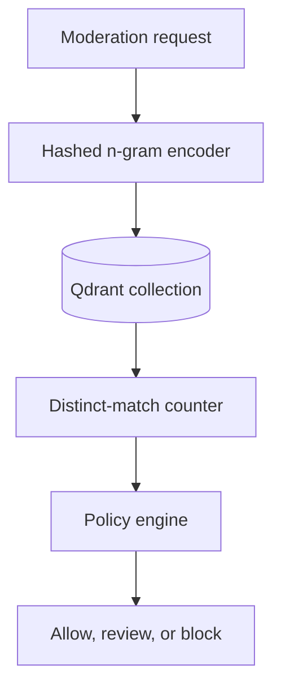

# Vector threat-intelligence architecture

Milestone 5 adds a retrieval signal for repeated or lightly obfuscated content. This addresses a
distribution pattern that a per-message toxicity classifier cannot see: individually ambiguous
messages may become risky when many accounts or requests repeat the same payload.



## Detection contract

The encoder normalizes Unicode and common character substitutions, extracts character n-grams of
length three through five, hashes them into a 384-dimensional vector, and applies L2
normalization. Qdrant performs cosine similarity search with a default threshold of 0.90.

| Prior distinct matches | Campaign risk | Effect |
| ---: | ---: | --- |
| 0–1 | 0.00 | No campaign signal |
| 2 | 0.65 | Review |
| 3 | 0.70 | Review |
| 4 | 0.75 | Review |
| 5 or more | 0.90 | Block |

The search excludes the current `request_id`, so an idempotent replay does not increase the
campaign count. Each request is upserted under a deterministic UUID derived from that ID. A
`coordinated_abuse` signal uses source `vector:hashed-char-ngram-v1` and reason code
`similar_content_campaign`.

These thresholds are policy hypotheses for a portfolio deployment, not production safety claims.
They should be calibrated on representative campaign and benign-template data before launch.

## Data handling

Qdrant payloads contain only a request identifier. Raw user text is not stored in the vector
collection. This reduces accidental exposure and prevents the dashboard from becoming a raw-content
review surface.

Vectors are not anonymous. They may preserve information about their source and should be handled
as sensitive derived data. A production deployment requires authentication, TLS, network
isolation, retention and deletion policies, tenant separation, audit logs, and abuse-resistant
query limits. The Compose service is intentionally local and unauthenticated.

## Local verification

Start the stack and confirm all long-running services are healthy:

```bash
docker compose up -d --build
docker compose ps
```

Submit the same campaign text under three distinct request IDs using
`POST /v1/moderation/jobs`, polling each returned job ID. The first two requests should have no
campaign signal. The third should return `review` with:

```json
{
  "source": "vector:hashed-char-ngram-v1",
  "category": "coordinated_abuse",
  "reason_code": "similar_content_campaign"
}
```

The collection can be inspected locally at `http://localhost:6333/dashboard`. Stop the stack with
`docker compose down`; add `-v` only when intentionally deleting Redis and Qdrant data.

## Limitations and next steps

- Hash collisions and short or generic templates may create false positives.
- Paraphrases with substantially different character sequences may evade detection.
- A single global collection is insufficient for multi-tenant isolation.
- Similarity alone does not prove malicious coordination; account, time, and distribution signals
  are needed for stronger attribution.
- A future semantic encoder can implement the existing `TextEncoder` protocol, but must be
  evaluated for multilingual performance, privacy leakage, latency, cost, and adversarial drift.
