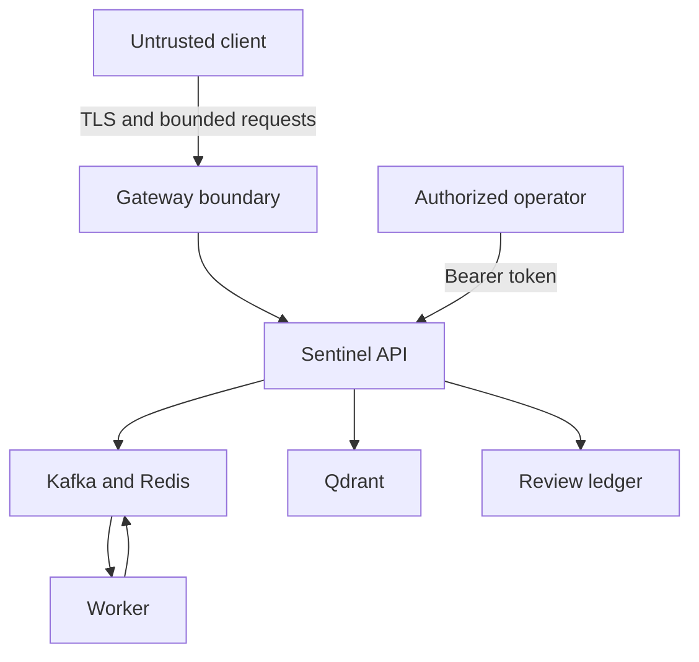

# Sentinel threat model

## Scope and assets

The model covers the public API boundary, asynchronous moderation pipeline, model artifacts,
reviewer workflow, vector threat intelligence, metrics, and the local deployment configuration.
Assets include user confidentiality, moderation integrity, reviewer identity, audit history, model
artifacts, service availability, and promotion-gate evidence.

## Trust boundaries

The repository implements the API-side controls. A production gateway, authenticated data
services, managed secrets, and encrypted storage remain deployment responsibilities.

## Threats and controls

| Threat | Example | Implemented control | Residual risk / production action |
| --- | --- | --- | --- |
| Spoofing | Forged reviewer identity | SHA-256 token lookup, bounded roles, constant-time comparison | Replace demonstration tokens with short-lived identity-provider credentials |
| Tampering | Audit record edited on disk | Sequence numbers and SHA-256 hash chaining validated on load | Use append-only transactional storage, retention locks, backup verification |
| Repudiation | Reviewer denies an action | Opaque reviewer ID, action, timestamp, reason code, prior-event hash | Centralize signed audit events and independent access logs |
| Information disclosure | User text leaks into telemetry | Low-cardinality labels; audit/export omit raw text, images and free-form notes | Apply encryption, retention, DLP review and least-privilege access |
| Denial of service | Oversized Base64 image or request flood | Body limit, image limits, token bucket, queue bounds, SLO alerts | Enforce limits at gateway; use a shared limiter across replicas |
| Elevation of privilege | Compromised process modifies host | Non-root image, dropped capabilities, read-only root, no-new-privileges | Add orchestrator policy, seccomp/AppArmor and workload identity |
| Supply-chain compromise | Vulnerable or replaced dependency | Lockfile, deterministic SBOM, CodeQL, Dependabot, checksum-pinned image candidate | Add registry signing, admission policy and blocking vulnerability scan |
| Model abuse | Evasion or threshold regression | Normalization, adversarial slices, ensemble, promotion gate, human review | Expand multilingual, subgroup and real-world red-team evaluation |
| Vector leakage | Embeddings reveal source content | Qdrant stores opaque IDs and vectors, not raw text | Encrypt, authenticate, set retention, and assess inversion risk |

## Abuse cases explicitly tested

- Reused idempotency keys with different content return HTTP 409.
- Content-type and image-signature mismatches return HTTP 415.
- Oversized request bodies return HTTP 413 before endpoint processing.
- Excess requests return HTTP 429 with bounded rate-limit metadata.
- Reviewer role violations are rejected.
- Modified review-ledger chains fail validation on startup.
- Case changes, punctuation, zero-width characters, leetspeak, and character flooding are evaluated
  through the deployed normalization path.

## Assumptions

- TLS is terminated before the application in production.
- Client IP identity is supplied by a trusted gateway; the application intentionally does not
  trust arbitrary forwarding headers.
- Kafka, Redis, Qdrant, Prometheus, and Grafana are not exposed to untrusted networks.
- Review credentials and model artifacts are provisioned outside Git.
